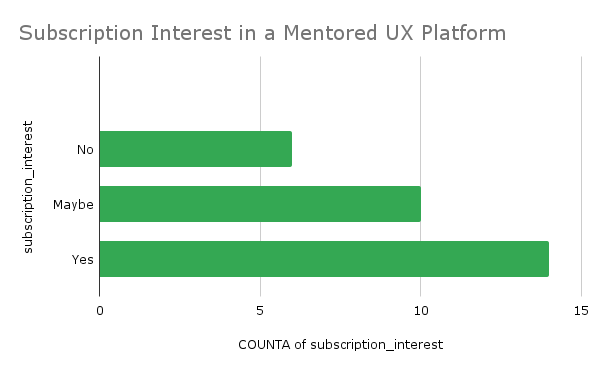
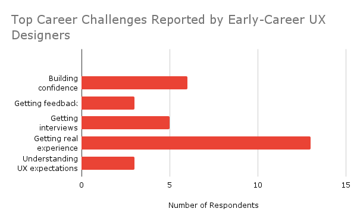
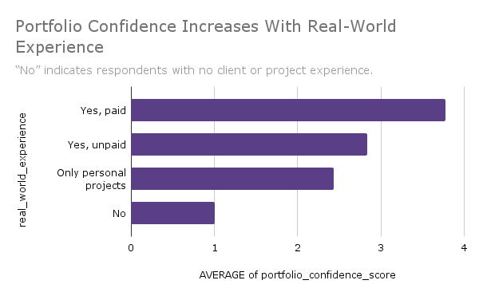
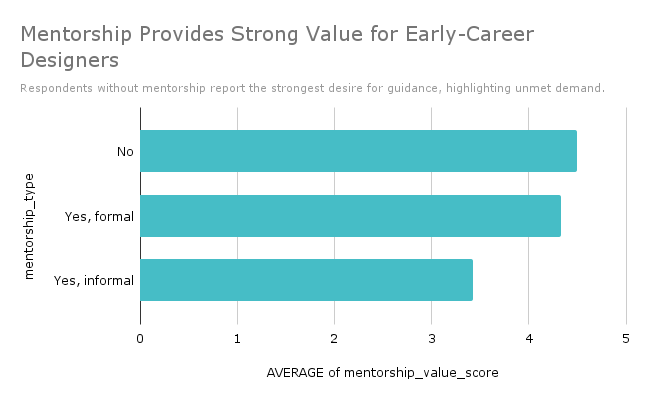

# Genhouse UX Survey Analysis
This project explores survey responses from early-career UX designers using SQL and Google Sheets dashboards, with a focus on mentorship demand, career challenges, and pricing expectations.

## What I Did
In this project, I:
- Cleaned and organized raw Google Forms survey responses  
- Wrote SQL queries to explore trends in confidence, mentorship, and pricing expectations  
- Built pivot-table dashboards in Google Sheets to visualize key patterns  
- Summarized findings into product and community recommendations for Genhouse

--- 

## Project Overview
This project analyzes UX survey data collected by the Genhouse UX team to understand
junior designers’ career challenges, confidence levels, and interest in mentored real-world projects.

The goal of this analysis was to transform raw survey responses into actionable insights
that can inform Genhouse’s product, mentorship, and community strategy.

---

## Business Context
Genhouse aims to support early-career UX designers by offering structured projects,
mentorship, and career guidance. The UX team conducted a survey to better understand:

- Barriers to job applications  
- Portfolio confidence gaps  
- Demand for real-world UX experience  
- Willingness to pay for mentored project platforms  

This analysis was conducted to support data-informed decision making.

---

## Tools Used
- Google Forms (survey collection)
- Google Sheets (data cleaning & visualization)
- SQLite (data storage)
- SQL (data analysis)

---

## Dataset
- Source: Genhouse UX Team Survey
- Records: UX designers at student, junior, and career-switcher levels
- Format: CSV exported from Google Sheets

---

## Dataset Privacy Note

The full survey dataset is not shared publicly to protect participant privacy.  
This repository includes a small anonymized sample dataset in `/data/` for demonstration purposes.

---

## Key Questions Explored
- What are the biggest challenges preventing designers from applying to jobs?
- How confident are junior designers in their portfolios?

---

## Key Questions Explored
- What are the biggest challenges preventing designers from applying to jobs?
- How confident are junior designers in their portfolios?
- Is there demand for NGO or real-world UX projects?
- What pricing range feels reasonable for mentored platforms?
- How valuable is mentorship for early UX careers?

---

## Key Insights

- **Real-world experience is the biggest barrier** for early-career UX designers, with most respondents reporting difficulty gaining portfolio-worthy client work.

- **Imposter syndrome and lack of mentorship remain major blockers**, showing that confidence—not just skill—is a key challenge in the job search.

- Designers with **paid or unpaid client experience report higher portfolio confidence**, suggesting practical projects strongly influence career readiness.

- There is **clear demand for structured, mentored UX projects**, with most respondents saying they would consider subscribing to a guided platform.

- Among interested users, the most common pricing expectation was **$11–$25/month**, indicating affordability is essential for early-career designers.

---

## Business Implications

- Early-career designers need **accessible ways to gain real client experience**, not just more coursework or portfolio templates.

- A mentored project platform could differentiate itself by offering **low-pressure, real-world practice with feedback loops**.

- Pricing strategy should prioritize **student- and junior-friendly tiers**, aligning with the strongest willingness-to-pay range.

- Mentorship is not optional—it is a **core value driver** for retention, confidence growth, and long-term engagement.

---

## SQL Analysis
All SQL queries used for analysis can be found here:
[View the full SQL analysis here](sql/ux_survey_analysis.sql)

---

## Visualizations

The following charts summarize the most important findings from the survey analysis:

### Subscription Interest in a Mentored UX Platform

**Key Insight:** Most respondents said they would *yes* or *maybe* pay for a mentored UX platform, showing strong demand for guided real-world project experience.

---

### Preferred Monthly Pricing (Interested Users Only)

**Key Insight:** Among users open to subscribing, the most common pricing expectation was **$11–$25/month**, suggesting affordability is critical for early-career designers.

---

### Top Career Challenges Reported by Early-Career UX Designers

**Key Insight:** The biggest challenge respondents reported was **getting real-world experience**, highlighting a major gap between learning UX skills and building portfolio-worthy client work.

---

### Portfolio Confidence Increases With Real-World Experience

**Key Insight:** Designers with paid or unpaid client experience reported noticeably higher portfolio confidence, reinforcing the importance of practical project opportunities early in a UX career.

---

### Mentorship Provides Strong Value for Early-Career Designers

**Key Insight:** Respondents rated mentorship as highly valuable across all categories, indicating mentorship is a key driver of confidence and retention.

---

## Next Steps
- Segment users by experience level for personalized offerings
- Validate pricing through A/B testing
- Track confidence improvement over time with repeat surveys
